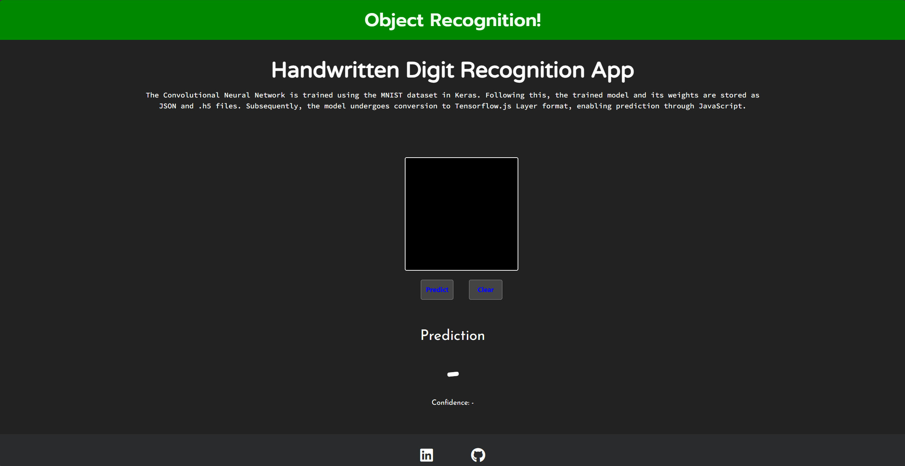
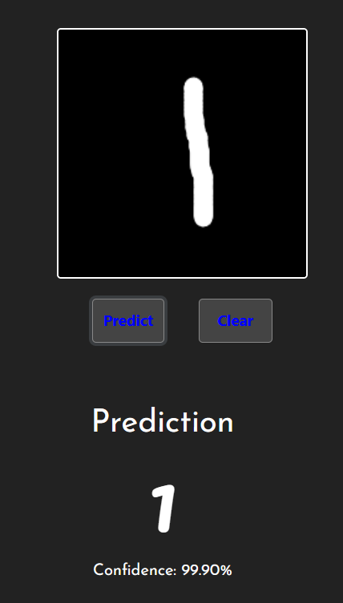

# Handwritten Digit Recognition Web Application

Welcome to the Handwritten Digit Recognition Web Application! This application allows you to draw a digit on a canvas, and it predicts the digit using a trained Convolutional Neural Network (CNN).

## Features

- Draw a digit on the canvas provided.
- Click the "Predict" button to predict the drawn digit.
- Click the "Clear" button to clear the canvas.
- View the predicted digit and its confidence level.

## Screenshots

## Technologies Used

- TensorFlow.js: For running the trained CNN model in the browser.
- Keras: Used to train the CNN on the MNIST dataset.
- Bootstrap: For styling the web application.
- jQuery: For handling DOM manipulation and events.

## Getting Started

To run the application locally, follow these steps:

1. Clone this repository to your local machine.
2. Open the `index.html` file in your web browser.

Alternatively, you can access the live version of the application [here]([#](https://mnist-nodejs.onrender.com/)).

## Contributing

If you want to contribute to this project, follow these steps:

1. Fork this repository.
2. Create a new branch (`git checkout -b feature/improvement`).
3. Make your changes.
4. Commit your changes (`git commit -am 'Add new feature'`).
5. Push to the branch (`git push origin feature/improvement`).
6. Create a new Pull Request.

## License

This project is licensed under the MIT License - see the [LICENSE](LICENSE) file for details.

## Author

[Muhammad Ayman](https://github.com/Muhammad-Ayman)

## Acknowledgments

- The TensorFlow.js team for providing an excellent framework for running machine learning models in the browser.
- The creators of the MNIST dataset for providing the data to train the model.
- Bootstrap for simplifying the process of styling the web application.
